# Chapter 3: Physical Layer

## Introduction

The **Physical Layer** is the lowest layer in the OSI (Open Systems Interconnection) model and the TCP/IP protocol suite. It is responsible for the actual transmission of raw bits over a physical medium. This layer defines the mechanical, electrical, procedural, and functional specifications for activating, maintaining, and deactivating physical links between network devices.

**Learning Objectives:**
- Understand various transmission media and their characteristics
- Differentiate between analog and digital signals
- Comprehend different transmission modes
- Master line coding techniques used in digital communication
- Apply Nyquist and Shannon theorems to calculate channel capacity

---

## 1. Transmission Media

Transmission media serves as the physical pathway for data transmission between sender and receiver. It can be broadly classified into **guided** (wired) and **unguided** (wireless) media.

### 1.1 Guided Media (Wired)

Guided media provides a physical conduit that directs signals along a specific path. The signal is confined within the medium, offering better security and reliability compared to wireless transmission.

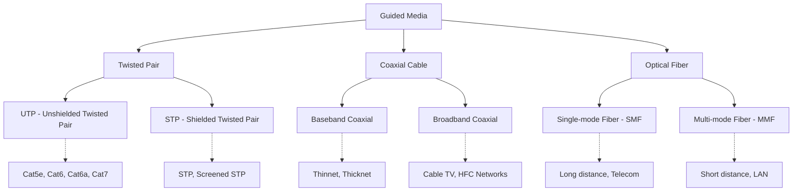

#### 1.1.1 Twisted Pair Cable

Twisted pair consists of two insulated copper wires twisted together in a helical pattern. The twisting helps reduce electromagnetic interference (EMI) and crosstalk.

| Type | Shielding | Max Bandwidth | Typical Use Case |
|------|-----------|---------------|------------------|
| **Cat5e** | None | 100 MHz | Fast Ethernet (100 Mbps) |
| **Cat6** | None/Slight | 250 MHz | Gigabit Ethernet (1 Gbps) |
| **Cat6a** | Enhanced | 500 MHz | 10 Gigabit Ethernet |
| **Cat7** | Full Shielded | 600 MHz | Data Centers |

**Advantages:**
- Low cost and easy installation
- Flexible and lightweight
- Widely available and supported

**Disadvantages:**
- Limited bandwidth compared to fiber
- Susceptible to EMI and crosstalk
- Attenuation increases with distance

#### 1.1.2 Coaxial Cable

Coaxial cable consists of a central conductor surrounded by insulation, a metallic shield, and an outer jacket. It offers better shielding than twisted pair.

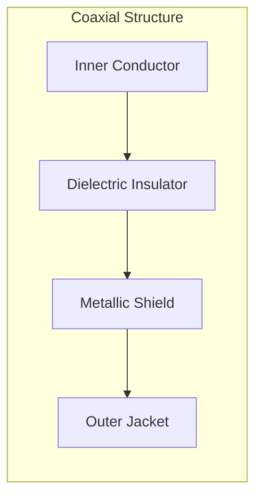

| Type | Signal Type | Application | Characteristics |
|------|-------------|-------------|-----------------|
| **Baseband** | Digital | Ethernet (10Base2, 10Base5) | Single channel, digital transmission |
| **Broadband** | Analog | Cable TV, Internet | Multiple channels, analog transmission |

**Advantages:**
- Higher bandwidth than twisted pair
- Better immunity to noise
- Longer transmission distances

**Disadvantages:**
- More expensive than twisted pair
- Bulky and less flexible
- Being replaced by fiber in many applications

#### 1.1.3 Optical Fiber

Optical fiber uses light pulses to transmit data through a glass or plastic core, offering the highest bandwidth and longest transmission distances.

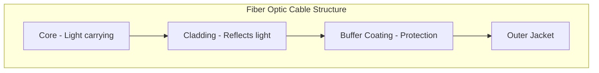

| Type | Core Diameter | Light Source | Distance | Application |
|------|---------------|--------------|----------|-------------|
| **Single-mode (SMF)** | 8-10 μm | Laser | Up to 100 km | WAN, Telecom |
| **Multi-mode (MMF)** | 50-62.5 μm | LED/VCSEL | Up to 2 km | LAN, Data Centers |

**Advantages:**
- Extremely high bandwidth (Tbps range)
- Very low attenuation
- Immune to electromagnetic interference
- Highly secure (difficult to tap)

**Disadvantages:**
- High installation cost
- Fragile and requires careful handling
- Complex splicing and termination

---

### 1.2 Unguided Media (Wireless)

Unguided media transmits electromagnetic waves through air, vacuum, or water without requiring a physical conduit.

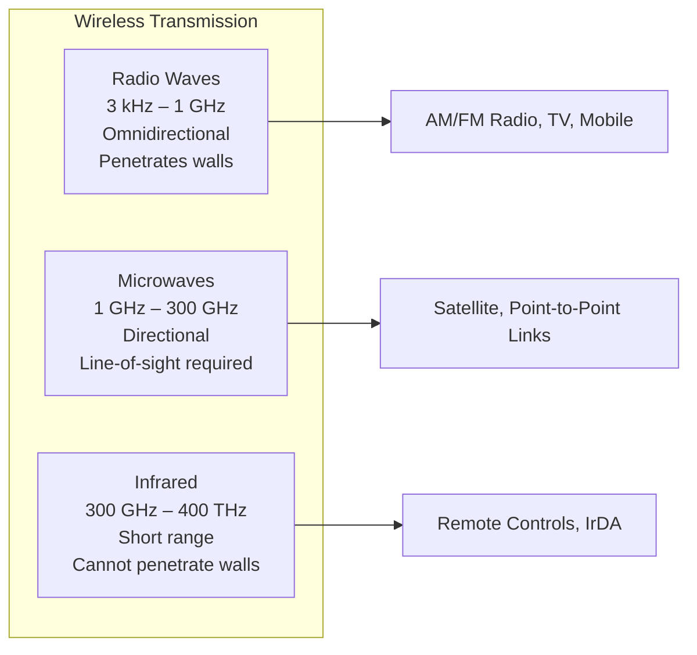

#### Comparison of Wireless Media

| Feature | Radio Waves | Microwaves | Infrared |
|---------|-------------|------------|----------|
| **Frequency** | 3 kHz – 1 GHz | 1 GHz – 300 GHz | 300 GHz – 400 THz |
| **Propagation** | Omnidirectional | Unidirectional | Unidirectional |
| **Penetration** | High | Low | None |
| **Range** | Long | Medium-Long | Short |
| **Interference** | High | Medium | Low |
| **Security** | Low | Medium | High |
| **Cost** | Low | Medium | Low |

**Radio Waves:**
- Used for broadcasting (AM/FM radio, television)
- Can travel long distances and penetrate buildings
- Prone to interference from other radio sources

**Microwaves:**
- Require line-of-sight between transmitter and receiver
- Used in satellite communication and point-to-point links
- Affected by rain, fog, and atmospheric conditions

**Infrared:**
- Cannot penetrate solid objects
- Used in short-range communication (remote controls, IrDA)
- High security due to limited range

---

## 2. Signal Types: Analog vs Digital

Understanding the difference between analog and digital signals is fundamental to comprehending data transmission.

### 2.1 Analog Signals

An **analog signal** is a continuous waveform that varies smoothly over time. It can take an infinite number of values within a given range.

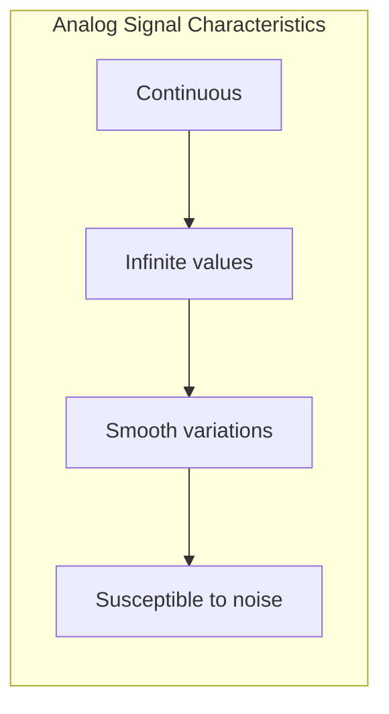

**Characteristics:**
- Continuous in both time and amplitude
- Represents physical quantities (sound, temperature, light)
- More susceptible to noise and distortion
- Requires amplification (which also amplifies noise)

**Examples:**
- Human voice
- Analog radio/TV signals
- Temperature sensors
- Traditional telephone systems

### 2.2 Digital Signals

A **digital signal** is a discrete signal that represents data using specific values, typically binary (0 and 1). It changes in steps rather than continuously.

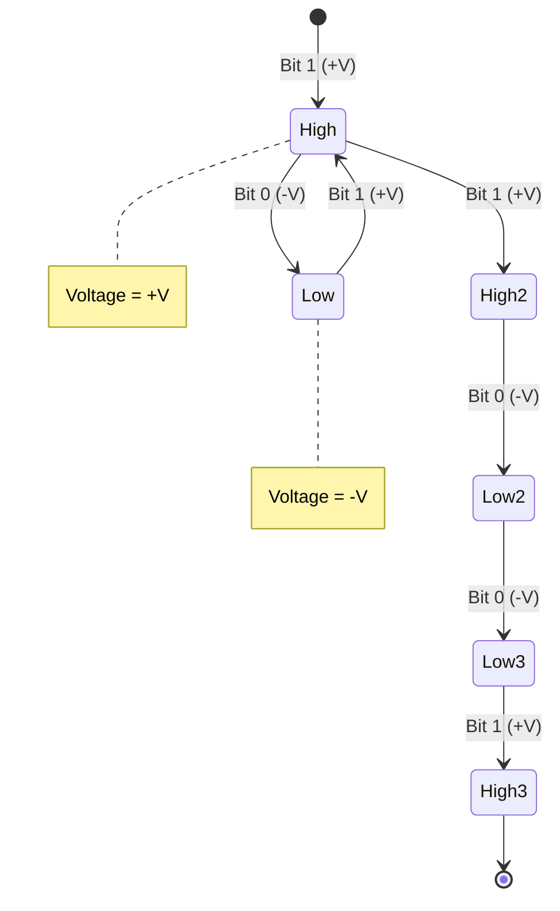

**Characteristics:**
- Discrete in time and amplitude
- Uses binary representation (0s and 1s)
- Less affected by noise
- Easier to store, process, and transmit
- Can be regenerated without cumulative distortion

**Advantages of Digital over Analog:**

| Aspect | Analog | Digital |
|--------|--------|---------|
| **Noise Immunity** | Low | High |
| **Error Correction** | Difficult | Easy |
| **Storage** | Complex | Simple |
| **Processing** | Limited | Extensive |
| **Security** | Hard to encrypt | Easy to encrypt |
| **Quality over distance** | Degrades | Maintained |

### 2.3 Signal Conversion

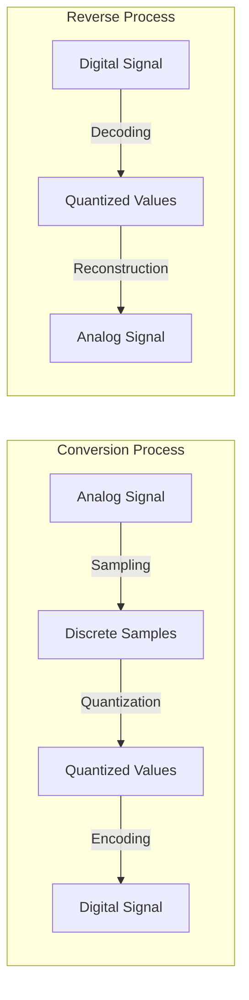

**Key Conversion Techniques:**
- **PCM (Pulse Code Modulation):** Standard method for digitizing analog signals
- **Delta Modulation:** Encodes changes in signal rather than absolute values
- **ADC/DAC:** Analog-to-Digital and Digital-to-Analog Converters

---

## 3. Transmission Modes

Transmission mode defines the direction of data flow between two communicating devices.

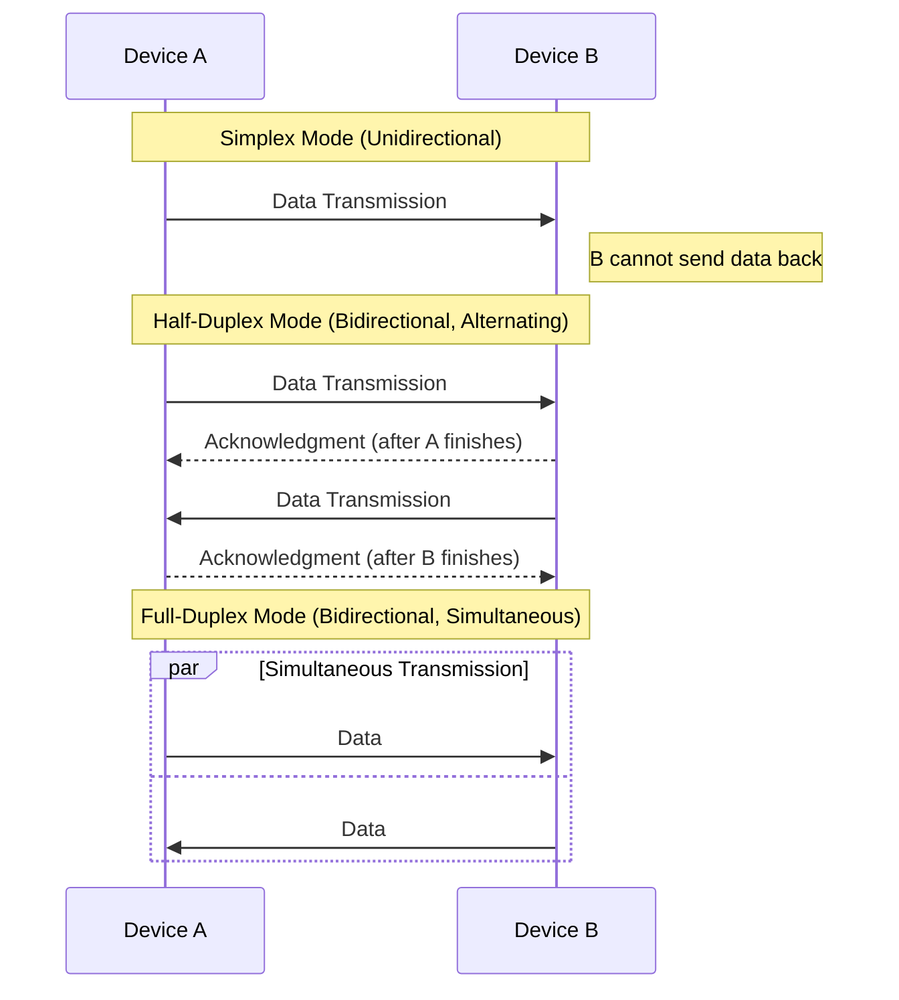

### 3.1 Detailed Comparison

| Mode | Direction | Simultaneous | Channels | Efficiency | Example |
|------|-----------|--------------|----------|------------|---------|
| **Simplex** | One-way | N/A | 1 | Low | Keyboard, TV broadcast |
| **Half-Duplex** | Two-way | No | 1 | Medium | Walkie-talkie, CB radio |
| **Full-Duplex** | Two-way | Yes | 2 | High | Telephone, Ethernet |

### 3.2 Use Cases

**Simplex:**
- Broadcasting (radio, TV)
- Keyboard to computer
- Sensors to controllers
- Fire alarms

**Half-Duplex:**
- Walkie-talkies
- Citizen Band (CB) radio
- Early Ethernet (10Base5)
- Wireless LANs (older standards)

**Full-Duplex:**
- Telephone networks
- Modern Ethernet (switched)
- Cellular networks
- Instant messaging

---

## 4. Line Coding Techniques

Line coding is the process of converting digital data into digital signals for transmission. Different techniques offer various trade-offs between bandwidth efficiency, synchronization, and DC balance.

### 4.1 Key Concepts

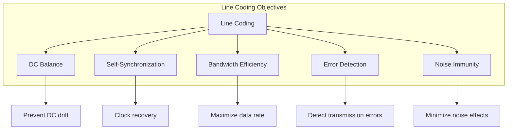

**Important Terms:**
- **Baseline:** The average voltage level used as reference
- **DC Component:** Constant voltage offset that can cause problems
- **Baud Rate:** Number of signal changes per second
- **Bit Rate:** Number of bits transmitted per second

### 4.2 NRZ-L (Non-Return to Zero, Level)

In NRZ-L encoding, the voltage level directly represents the bit value.

**Encoding Rules:**
- Bit `1` → Positive voltage (+V)
- Bit `0` → Negative voltage (-V)
- No return to zero between bits

**Example:** Bits `1 0 1 1 0 0 1`

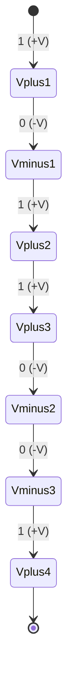

**Waveform Representation:**

| Bit | 1 | 0 | 1 | 1 | 0 | 0 | 1 |
|-----|---|---|---|---|---|---|---|
| Voltage | +V | -V | +V | +V | -V | -V | +V |

**Advantages:**
- Simple to implement
- Efficient bandwidth usage
- Good for short-distance communication

**Disadvantages:**
- DC component present (problematic for transformers)
- No self-synchronization (long runs of same bit cause loss of clock)
- No error detection capability

### 4.3 NRZ-I (Non-Return to Zero, Inverted)

In NRZ-I, the signal inverts when a `1` is encountered and stays the same for `0`.

**Encoding Rules:**
- Bit `1` → Invert the signal
- Bit `0` → No change (maintain previous level)

**Example:** Bits `1 0 1 1 0 0 1`

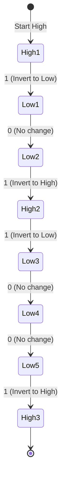

**Comparison: NRZ-L vs NRZ-I**

| Feature | NRZ-L | NRZ-I |
|---------|-------|-------|
| **Encoding** | Voltage = bit value | Invert on 1 |
| **DC Component** | May have | Reduced |
| **Synchronization** | Poor | Better for 1s |
| **Complexity** | Simple | Slightly complex |

### 4.4 Manchester Coding (IEEE 802.3)

Manchester encoding provides self-synchronization by ensuring a transition in the middle of every bit period.

**Encoding Rules:**
- Bit `1` → High-to-Low transition (falling edge)
- Bit `0` → Low-to-High transition (rising edge)

**Example:** Bits `1 0 1 0`

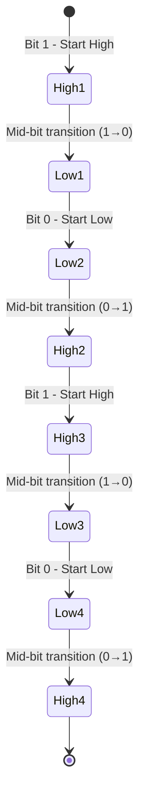

**Detailed Transition Table:**

| Bit | Start Level | Mid-Bit Transition | End Level | Next Start |
|-----|-------------|-------------------|-----------|------------|
| 1 | High | High → Low | Low | Low |
| 0 | Low | Low → High | High | High |
| 1 | High | High → Low | Low | Low |
| 0 | Low | Low → High | High | High |

**Differential Manchester:**
- Transition in middle of bit (for clocking)
- Transition at start of bit indicates `0`
- No transition at start indicates `1`

**Advantages:**
- Self-synchronizing (clock embedded in signal)
- No DC component
- Error detection capability

**Disadvantages:**
- Requires 2× bandwidth of NRZ
- More complex encoding/decoding

### 4.5 Bipolar AMI (Alternate Mark Inversion)

AMI uses three voltage levels: positive, zero, and negative.

**Encoding Rules:**
- Bit `0` → 0V (zero level)
- Bit `1` → Alternating +V and -V

**Example:** Bits `1 0 1 1 0 1`

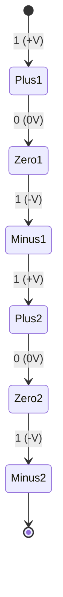

**Waveform Representation:**

| Bit | 1 | 0 | 1 | 1 | 0 | 1 |
|-----|---|---|---|---|---|---|
| Voltage | +V | 0V | -V | +V | 0V | -V |

**Advantages:**
- No DC component
- Self-synchronizing for 1s
- Error detection (violation of alternation rule)
- Efficient bandwidth usage

**Disadvantages:**
- Long sequences of 0s cause loss of synchronization
- Requires three voltage levels

### 4.6 Comparison of Line Coding Techniques

| Technique | DC Component | Synchronization | Bandwidth | Error Detection | Complexity |
|-----------|--------------|-----------------|-----------|-----------------|------------|
| **NRZ-L** | Yes | Poor | 1× | No | Low |
| **NRZ-I** | Reduced | Moderate | 1× | No | Low |
| **Manchester** | No | Excellent | 2× | Yes | Medium |
| **Diff. Manchester** | No | Excellent | 2× | Yes | Medium |
| **AMI** | No | Good | 1× | Yes | Medium |

---

## 5. Data Rate Concepts

### 5.1 Nyquist Theorem (Noiseless Channel)

The Nyquist theorem defines the maximum data rate for a noiseless channel.

**Formula:**
```
C = 2 × B × log₂(L)
```

Where:
- **C** = Channel capacity (bits per second)
- **B** = Bandwidth (Hz)
- **L** = Number of signal levels

**Key Insights:**
- Maximum symbol rate = 2B symbols/second
- More levels = more bits per symbol
- Trade-off: More levels → more susceptible to noise

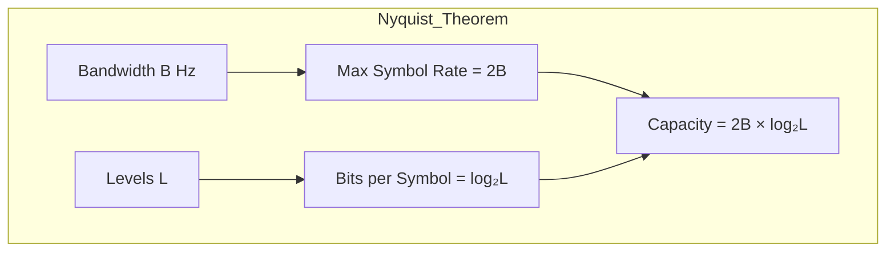

**Example Calculation:**
- Bandwidth = 3000 Hz
- Levels = 4 (2 bits per symbol)
- C = 2 × 3000 × log₂(4) = 2 × 3000 × 2 = 12,000 bps

### 5.2 Shannon Capacity (Noisy Channel)

The Shannon theorem defines the maximum data rate for a noisy channel.

**Formula:**
```
C = B × log₂(1 + S/N)
```

Where:
- **C** = Channel capacity (bits per second)
- **B** = Bandwidth (Hz)
- **S/N** = Signal-to-Noise Ratio (linear, not dB)

**Converting SNR from dB:**
```
S/N (linear) = 10^(SNR_dB / 10)
```

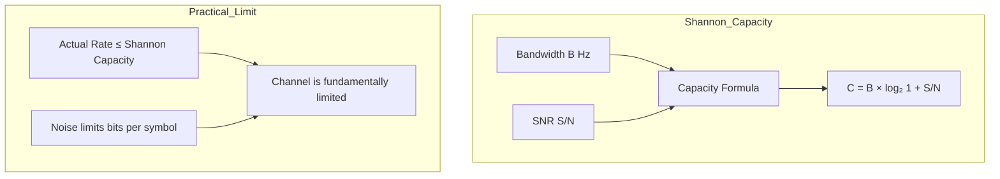

**Key Insights:**
- Shannon capacity is the theoretical maximum
- Cannot be exceeded regardless of encoding
- Noise fundamentally limits channel capacity
- Higher SNR allows more signal levels

### 5.3 Relationship Between Nyquist and Shannon

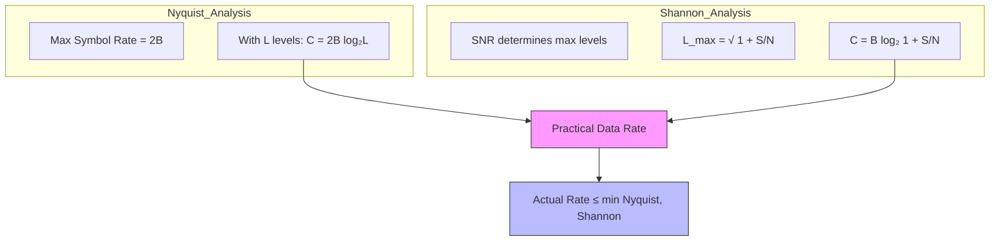

**Unified View:**
1. Nyquist tells us how fast we can send symbols (no noise consideration)
2. Shannon tells us how many bits per symbol are reliable (noise consideration)
3. Combining both: Maximum reliable data rate

### 5.4 Comprehensive Example

**Problem:** A telephone line has:
- Bandwidth (B) = 3.1 kHz = 3100 Hz
- SNR = 30 dB

**Solution:**

**Step 1: Convert SNR to linear scale**
```
S/N = 10^(30/10) = 10^3 = 1000
```

**Step 2: Calculate Shannon Capacity**
```
C = B × log₂(1 + S/N)
C = 3100 × log₂(1001)
C = 3100 × 9.97
C ≈ 30,900 bps ≈ 30.9 kbps
```

**Step 3: Determine maximum levels using Shannon**
```
L_max = √(1 + S/N) = √1001 ≈ 31.6 ≈ 31 levels
```

**Step 4: Calculate Nyquist Capacity with L = 31**
```
C = 2B × log₂(L)
C = 2 × 3100 × log₂(31)
C = 6200 × 4.95
C ≈ 30,690 bps ≈ 30.7 kbps
```

**Step 5: Compare with L = 4 (if only 4 levels used)**
```
C = 2 × 3100 × log₂(4) = 2 × 3100 × 2 = 12,400 bps
```

**Conclusion:** 
- With only 4 levels, the channel is Nyquist-limited (12.4 kbps)
- With optimal levels (31), we approach Shannon capacity (30.9 kbps)
- The channel is fundamentally limited by noise (Shannon)

### 5.5 Practical Implications

| Scenario | Limiting Factor | Solution |
|----------|-----------------|----------|
| Low noise, limited bandwidth | Nyquist | Increase signal levels |
| High noise | Shannon | Improve SNR or reduce rate |
| Both limited | Shannon | Fundamental channel limit |
| Long distance | Attenuation | Amplifiers/Regenerators |

---

## Summary Tables

### Transmission Media Comparison

| Medium | Bandwidth | Distance | Cost | EMI Immunity | Security |
|--------|-----------|----------|------|--------------|----------|
| **Twisted Pair** | Low-Medium | Short | Low | Low | Low |
| **Coaxial** | Medium | Medium | Medium | Medium | Medium |
| **Fiber Optic** | Very High | Very Long | High | Excellent | Excellent |
| **Radio** | Low-Medium | Long | Low | N/A | Low |
| **Microwave** | High | Long | Medium | N/A | Medium |
| **Infrared** | High | Short | Low | N/A | High |

### Line Coding Summary

| Technique | DC Component | Sync | Bandwidth | Error Detection |
|-----------|--------------|------|-----------|-----------------|
| **NRZ-L** | Yes | Poor | 1× | No |
| **NRZ-I** | Reduced | Fair | 1× | No |
| **Manchester** | No | Excellent | 2× | Yes |
| **Diff. Manchester** | No | Excellent | 2× | Yes |
| **AMI** | No | Good | 1× | Yes |

### Capacity Formulas

| Theorem | Formula | Application | Limiting Factor |
|---------|---------|-------------|-----------------|
| **Nyquist** | C = 2B log₂(L) | Noiseless channel | Bandwidth & levels |
| **Shannon** | C = B log₂(1 + S/N) | Noisy channel | Bandwidth & SNR |

---

## Key Takeaways

1. **Transmission media** choice depends on bandwidth requirements, distance, cost, and environmental factors

2. **Digital signals** are preferred over analog for their noise immunity, ease of processing, and error correction capabilities

3. **Transmission modes** (simplex, half-duplex, full-duplex) determine the direction and simultaneity of data flow

4. **Line coding** techniques balance trade-offs between DC balance, synchronization, bandwidth efficiency, and error detection

5. **Nyquist theorem** defines the maximum symbol rate for noiseless channels

6. **Shannon theorem** defines the fundamental capacity limit imposed by noise

7. **Practical data rate** is always ≤ min(Nyquist capacity, Shannon capacity)

---

