# Chapter 4: Data Link Layer

## Introduction

The **Data Link Layer** is the second layer of the OSI model and the TCP/IP protocol suite. It sits between the **Network Layer** (Layer 3) and the **Physical Layer** (Layer 1). Its primary responsibility is to provide **node-to-node** (hop-to-hop) delivery of data frames across a physical link.

While the Physical Layer deals with raw bits, the Data Link Layer organizes these bits into **frames**, adds addressing information, detects and corrects errors, controls the flow of data, and manages access to the shared communication medium.

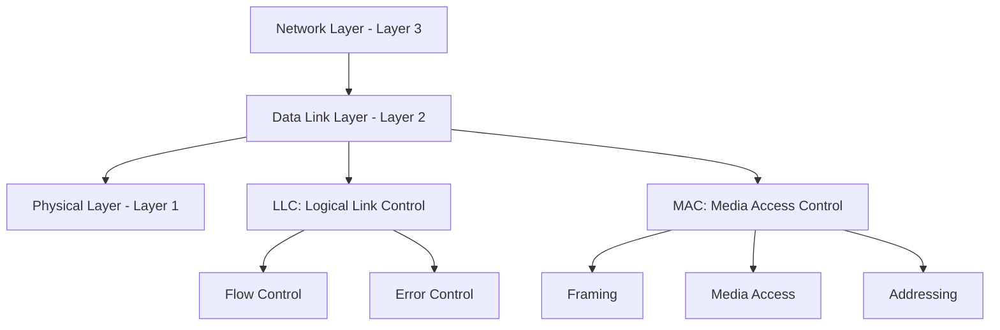

**Learning Objectives:**
- Understand the core functions of the Data Link Layer
- Master framing techniques and their trade-offs
- Apply error detection and correction methods (Parity, Checksum, CRC, Hamming)
- Analyze flow and error control protocols (Stop-and-Wait, Sliding Window, ARQ variants)
- Comprehend MAC addressing and channel access protocols (ALOHA, CSMA/CD, CSMA/CA)

---

## 1. Functions of the Data Link Layer

The Data Link Layer performs several critical functions to ensure reliable data transfer across a physical link.

### 1.1 Framing

Framing is the process of encapsulating data from the Network Layer into **frames** for transmission. It provides boundaries so the receiver can identify the start and end of each frame.

**Why Framing is Necessary:**
- Physical layer transmits a continuous stream of bits
- Receiver needs to know where one frame ends and the next begins
- Allows error detection on a per-frame basis
- Enables flow control and addressing

**Framing Methods:**

| Method | Description | Advantages | Disadvantages |
|--------|-------------|------------|---------------|
| **Character Count** | First field specifies frame length | Simple | Error in count corrupts framing |
| **Flag Bytes with Byte Stuffing** | Special FLAG byte marks boundaries; ESC for stuffing | Reliable | Inefficient for binary data |
| **Flag Bits with Bit Stuffing** | Special bit pattern (e.g., 01111110); insert 0 after five 1s | Efficient, widely used | More complex |
| **Physical Layer Coding Violations** | Use invalid signal patterns as delimiters | No overhead | Limited to specific encoding schemes |

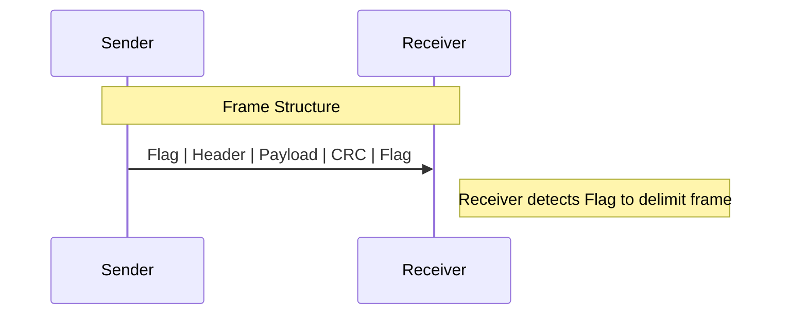

**Bit Stuffing Example (HDLC):**
- Flag = `01111110`
- Data = `011111101111101`
- After stuffing: `01111101011111001` (0 inserted after five consecutive 1s)

### 1.2 Error Detection and Correction

Transmission errors occur due to noise, attenuation, and interference. The Data Link Layer adds redundancy to detect and sometimes correct these errors.

**Types of Errors:**
- **Single-bit error:** Only one bit is changed
- **Burst error:** Multiple consecutive bits are corrupted

**Error Control Approaches:**
- **Detection:** Receiver detects error and requests retransmission (ARQ)
- **Correction:** Receiver corrects error using redundant bits (FEC)

### 1.3 Flow Control

Flow control prevents a fast sender from overwhelming a slow receiver. It ensures the receiver's buffer does not overflow.

**Techniques:**
- **Stop-and-Wait:** Sender sends one frame and waits for ACK
- **Sliding Window:** Sender can send multiple frames before needing ACK

### 1.4 Access Control

When multiple devices share a common communication medium, the Data Link Layer determines **who gets to transmit** and **when**. This is handled by the **MAC (Media Access Control)** sub-layer.

---

## 2. Error Detection and Correction

### 2.1 Parity Check

Parity is the simplest error detection technique. A single **parity bit** is added to make the total number of 1s either even or odd.

**Types:**
- **Even Parity:** Total number of 1s (including parity) is even
- **Odd Parity:** Total number of 1s (including parity) is odd

**Example (Even Parity):**

| Data | Parity Bit | Transmitted |
|------|------------|-------------|
| 1011 | 1 | 10111 |
| 1100 | 0 | 11000 |
| 1111 | 0 | 11110 |

**Limitations:**
- Detects only odd number of bit errors
- Cannot detect even number of errors
- Cannot correct errors

**Two-Dimensional Parity:**
- Arrange data in a matrix
- Add parity for each row and column
- Can detect and correct single-bit errors

```mermaid
flowchart TD
    subgraph 2D Parity Matrix
        A[1 0 1 1 | 1] --> B[0 1 1 0 | 0]
        B --> C[1 1 0 1 | 1]
        C --> D[0 0 1 1 | 0]
        D --> E[0 0 1 1 | 0]
    end
    style A fill:#f9f
    style B fill:#f9f
    style C fill:#f9f
    style D fill:#f9f
    style E fill:#f9f
```

### 2.2 Checksum

The Internet Checksum is used in IP, TCP, and UDP. It treats data as a sequence of 16-bit words, sums them using **one's complement arithmetic**, and appends the complement of the sum.

**Algorithm:**
1. Divide data into 16-bit words
2. Sum all words using one's complement addition
3. Take one's complement of the sum
4. Append checksum to data

**Example:**
Data: `0x1234`, `0x5678`, `0x9ABC`

```
  0x1234
+ 0x5678
---------
  0x68AC
+ 0x9ABC
---------
  0x10368  -> wrap around: 0x0368 + 1 = 0x0369
One's complement: 0xFC96 (checksum)
```

**Advantages:**
- Simple to implement in software
- Good for detecting common errors

**Disadvantages:**
- Weaker than CRC
- Can miss some error patterns

### 2.3 CRC (Cyclic Redundancy Check)

CRC is a powerful error detection technique based on **polynomial division**. It is widely used in Ethernet, Wi-Fi, and storage devices.

**Key Concepts:**
- Data is treated as a polynomial
- A **generator polynomial** G(x) of degree r is agreed upon
- Sender appends r zeros to data, divides by G(x), and appends the remainder (CRC)
- Receiver divides received data by G(x); if remainder is zero, no error detected

**Steps:**
1. Let data = D(x), generator = G(x) of degree r
2. Append r zeros to D(x) → D(x)·x^r
3. Divide D(x)·x^r by G(x) using modulo-2 division
4. Remainder R(x) is the CRC (r bits)
5. Transmit T(x) = D(x)·x^r + R(x)
6. Receiver checks if T(x) / G(x) has remainder 0

**Example:**
- Data = `110101`
- Generator G = `1011` (degree 3, r = 3)
- Append `000` → `110101000`
- Perform modulo-2 division:

```
        111
      ______
1011 ) 110101000
       1011
       ----
        1100
        1011
        ----
         1111
         1011
         ----
          1000
          1011
          ----
           011  (remainder)
```

- CRC = `011`
- Transmitted frame = `110101011`

**Common Generator Polynomials:**

| Standard | Polynomial | Binary |
|----------|------------|--------|
| CRC-8 | x^8 + x^2 + x + 1 | 100000111 |
| CRC-16 | x^16 + x^15 + x^2 + 1 | 11000000000000101 |
| CRC-32 | x^32 + x^26 + x^23 + ... + 1 | 100000100110000010001110110110111 |

**Advantages:**
- Excellent error detection
- Efficient in hardware
- Detects all single-bit, double-bit, odd-number errors, and burst errors ≤ r

### 2.4 Hamming Code

Hamming codes are **error-correcting codes** that can detect and correct single-bit errors. They use multiple parity bits placed at positions that are powers of 2.

**Hamming Distance (d_min):**
- Number of bit positions in which two codewords differ
- To detect d errors: d_min ≥ d + 1
- To correct t errors: d_min ≥ 2t + 1

**Hamming(7,4) Code:**
- 4 data bits, 3 parity bits
- Positions 1, 2, 4 are parity bits
- Positions 3, 5, 6, 7 are data bits

**Parity Coverage:**

| Parity Bit | Position | Covers Positions |
|------------|----------|------------------|
| P1 | 1 | 1, 3, 5, 7 |
| P2 | 2 | 2, 3, 6, 7 |
| P4 | 4 | 4, 5, 6, 7 |

**Example: Data = 1011**

- Place data: pos3=1, pos5=0, pos6=1, pos7=1
- Calculate P1 (even parity over 1,3,5,7): 1 + 1 + 0 + 1 = 3 → P1 = 1
- Calculate P2 (even parity over 2,3,6,7): 1 + 1 + 1 + 1 = 4 → P2 = 0
- Calculate P4 (even parity over 4,5,6,7): 0 + 0 + 1 + 1 = 2 → P4 = 0

**Codeword:** `P1 P2 D1 P4 D2 D3 D4` = `1 0 1 0 0 1 1` → `1010011`

**Error Correction:**
- If a bit is flipped, the parity checks that fail indicate the error position
- Example: received `1010010` (last bit flipped)
  - P1 check: 1+1+0+0 = 2 (even) → pass
  - P2 check: 0+1+1+0 = 2 (even) → pass
  - P4 check: 0+0+1+0 = 1 (odd) → fail
  - Error position = 4 (only P4 fails) → flip bit 4

---

## 3. Flow and Error Control Protocols

### 3.1 Fundamentals

Flow and error control protocols ensure reliable data transfer by:
- **Acknowledgements (ACK):** Receiver confirms successful receipt
- **Timeouts:** Sender retransmits if ACK not received
- **Sequence Numbers:** Detect duplicate and out-of-order frames
- **Windows:** Allow multiple outstanding frames

### 3.2 Stop-and-Wait Protocol

The simplest flow control protocol. Sender sends one frame, then waits for an ACK before sending the next.

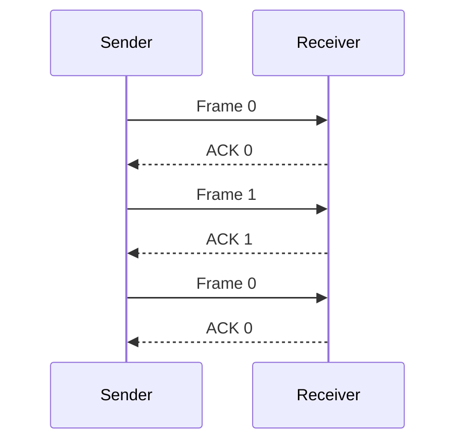

**Efficiency:**
```
U = T_frame / (T_frame + 2T_prop) = 1 / (1 + 2a)
```
where `a = T_prop / T_frame`

**Advantages:**
- Simple to implement
- Low buffer requirements

**Disadvantages:**
- Very inefficient for high bandwidth-delay product links
- Only one frame in flight

### 3.3 Sliding Window Protocol

Allows sender to transmit multiple frames without waiting for individual ACKs. The **window size** determines how many frames can be outstanding.

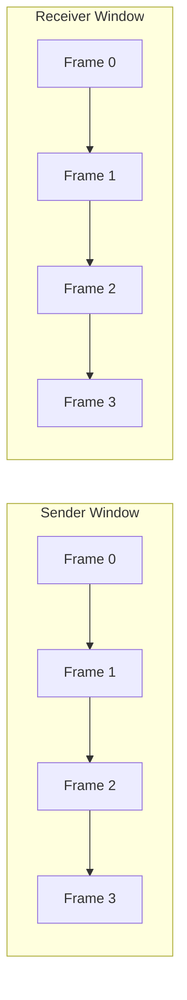

**Key Parameters:**
- **Window Size (W):** Number of frames that can be sent without ACK
- **Sequence Number Space:** Must be > W to avoid ambiguity
- **Efficiency:**
  - If W ≥ 1 + 2a: U = 1
  - If W < 1 + 2a: U = W / (1 + 2a)

**Advantages:**
- Efficient use of bandwidth
- Pipelining improves throughput

**Disadvantages:**
- More complex
- Requires buffering

### 3.4 ARQ (Automatic Repeat reQuest) Protocols

ARQ combines flow control with error control. When an error is detected, the receiver requests retransmission.

#### 3.4.1 Stop-and-Wait ARQ

- Sender sends one frame, waits for ACK
- If timeout, retransmits
- Sequence numbers: 0 and 1 (1 bit)
- ACK number indicates next expected frame

**Operation:**
1. Sender sends frame 0
2. Receiver receives correctly, sends ACK 1 (expecting frame 1)
3. Sender sends frame 1
4. If ACK lost, sender times out and retransmits
5. Receiver detects duplicate (same sequence number), discards and re-sends ACK

#### 3.4.2 Go-Back-N (GBN)

- Sender can send up to N frames without ACK
- Window size = N
- Sequence numbers: m bits, N = 2^m - 1
- **Cumulative ACK:** ACK n means all frames up to n-1 received
- If frame lost, all subsequent frames are retransmitted

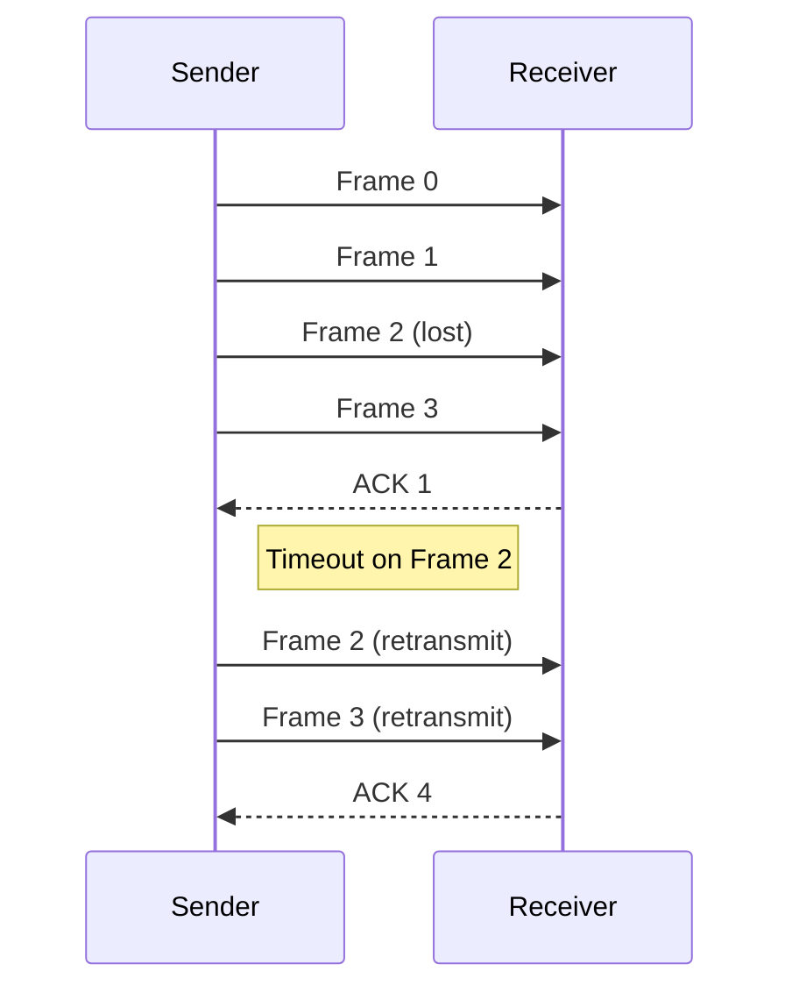

**Advantages:**
- Simple receiver (no buffering out-of-order)
- Efficient for low error rates

**Disadvantages:**
- Wasteful retransmission on error
- Requires large window for high efficiency

#### 3.4.3 Selective Repeat (SR)

- Sender can send up to N frames
- Window size = N
- Sequence numbers: m bits, N = 2^(m-1)
- Receiver ACKs each frame individually
- Only lost frames are retransmitted
- Receiver buffers out-of-order frames

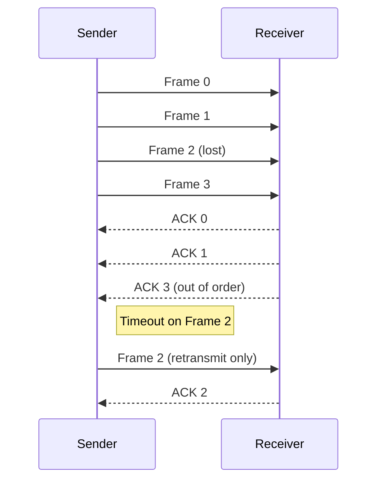

**Advantages:**
- Efficient retransmission
- Better for high error rates

**Disadvantages:**
- Complex receiver (buffering, reordering)
- Requires larger sequence number space

#### 3.4.4 Comparison of ARQ Protocols

| Feature | Stop-and-Wait ARQ | Go-Back-N | Selective Repeat |
|---------|-------------------|-----------|------------------|
| **Window Size** | 1 | 2^m - 1 | 2^(m-1) |
| **Sequence Numbers** | 1 bit | m bits | m bits |
| **ACK Type** | Individual | Cumulative | Individual |
| **Retransmission** | Only lost frame | Lost frame + all subsequent | Only lost frame |
| **Receiver Buffer** | None | None | Required |
| **Efficiency** | Low | Medium | High |
| **Complexity** | Low | Medium | High |

---

## 4. MAC Sub-layer

The **MAC (Media Access Control)** sub-layer is responsible for addressing and access control on shared media.

### 4.1 MAC Addressing

A **MAC address** is a 48-bit (6-byte) hardware address assigned to every network interface card (NIC). It is written in hexadecimal notation.

**Format:** `XX:XX:XX:YY:YY:YY`
- First 3 bytes (XX:XX:XX): **OUI (Organizationally Unique Identifier)** assigned by IEEE
- Last 3 bytes (YY:YY:YY): NIC-specific, assigned by manufacturer

**Types of MAC Addresses:**

| Type | First Byte LSB | Example | Description |
|------|----------------|---------|-------------|
| **Unicast** | 0 | `00:1A:2B:3C:4D:5E` | Single destination |
| **Multicast** | 1 | `01:00:5E:00:00:01` | Group of devices |
| **Broadcast** | All 1s | `FF:FF:FF:FF:FF:FF` | All devices on LAN |

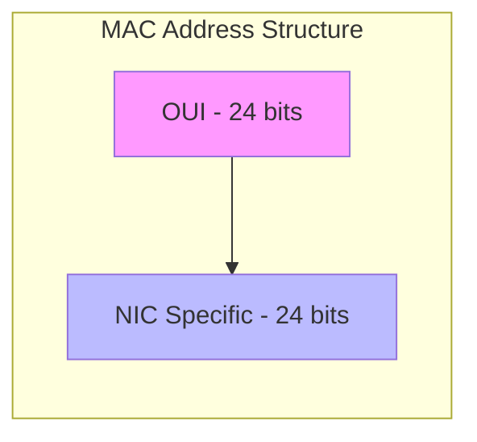

### 4.2 Channel Access Protocols

When multiple devices share a common medium, MAC protocols determine **who transmits next**.

**Classification:**

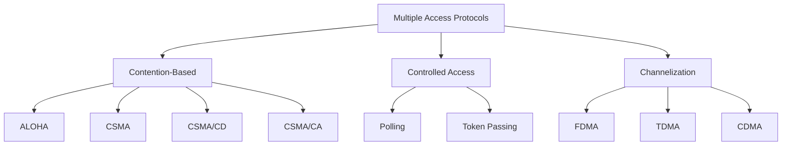

#### 4.2.1 ALOHA

ALOHA was developed at the University of Hawaii for wireless communication. It is the simplest contention-based protocol.

**Pure ALOHA:**
- Stations transmit whenever they have data
- If collision occurs, wait random time and retransmit
- No carrier sensing

**Throughput:**
```
S = G × e^(-2G)
```
- Max throughput = 1/(2e) ≈ 0.184 at G = 0.5

**Slotted ALOHA:**
- Time divided into slots
- Stations transmit only at beginning of slot
- Reduces collision window

**Throughput:**
```
S = G × e^(-G)
```
- Max throughput = 1/e ≈ 0.368 at G = 1

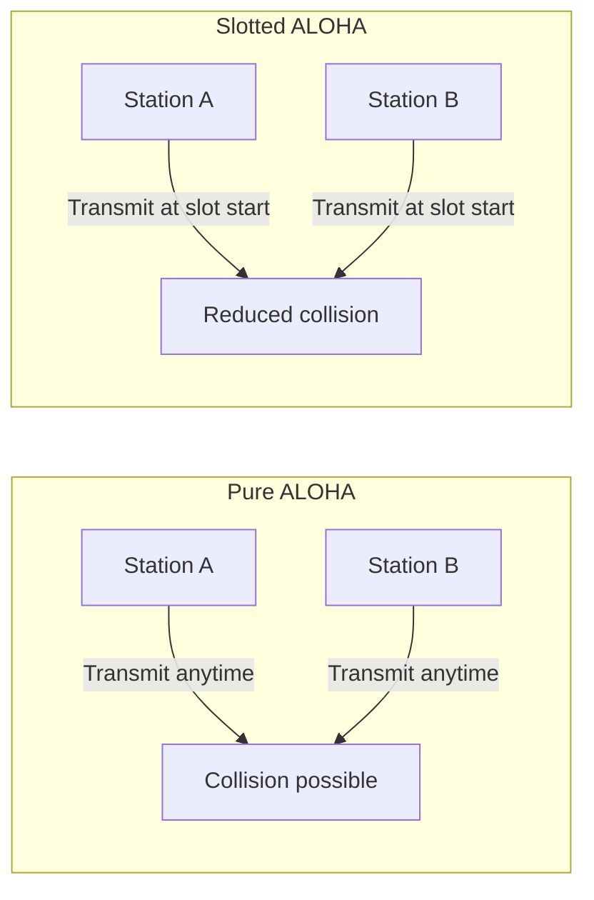

#### 4.2.2 CSMA/CD (Carrier Sense Multiple Access with Collision Detection)

Used in **wired Ethernet (IEEE 802.3)**. Stations listen before transmitting and detect collisions during transmission.

**Steps:**
1. **Carrier Sense:** Listen to medium
2. If idle, transmit
3. If busy, wait
4. **Collision Detection:** While transmitting, listen for collision
5. If collision detected:
   - Abort transmission
   - Send jam signal
   - Wait random time (binary exponential backoff)
   - Retry

**Binary Exponential Backoff:**
- After i-th collision, choose random k from [0, 2^i - 1]
- Wait k × slot time
- Slot time = 2 × maximum propagation delay

**Minimum Frame Size:**
- Must be long enough to detect collision before transmission ends
- For 10 Mbps Ethernet: 64 bytes (512 bits)
- Slot time = 51.2 μs

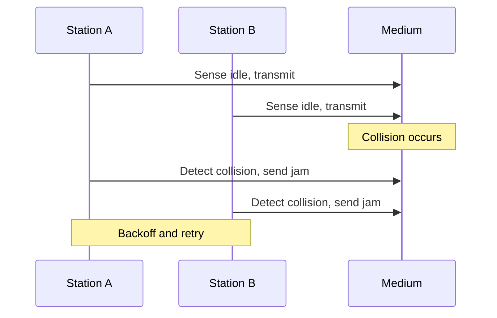

#### 4.2.3 CSMA/CA (Carrier Sense Multiple Access with Collision Avoidance)

Used in **wireless LANs (IEEE 802.11)**. Wireless stations cannot easily detect collisions while transmitting, so they **avoid** them.

**Why CSMA/CA?**
- Hidden terminal problem: A and C cannot hear each other, both transmit to B → collision at B
- Exposed terminal problem: B hears A transmitting, unnecessarily defers

**Mechanisms:**
- **IFS (Inter-Frame Space):** SIFS (short), DIFS (distributed), PIFS (point)
- **Backoff:** Random wait after medium becomes idle
- **ACK:** Receiver sends ACK after SIFS
- **RTS/CTS (optional):** Request-to-Send / Clear-to-Send handshake

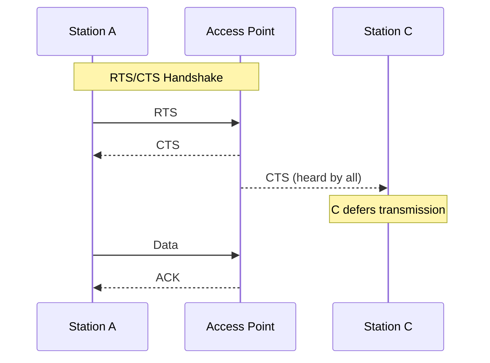

**CSMA/CA vs CSMA/CD:**

| Feature | CSMA/CD | CSMA/CA |
|---------|---------|---------|
| **Medium** | Wired | Wireless |
| **Collision Detection** | Yes | No |
| **Collision Avoidance** | No | Yes (RTS/CTS, IFS) |
| **ACK** | Not always | Always |
| **Standard** | IEEE 802.3 | IEEE 802.11 |
| **Efficiency** | High | Lower due to overhead |

---

## Summary Tables

### Error Detection Methods

| Method | Overhead | Detection Capability | Correction | Complexity |
|--------|----------|----------------------|------------|------------|
| **Parity** | 1 bit | Odd errors | No | Low |
| **2D Parity** | Row+Col | Single-bit | Yes | Medium |
| **Checksum** | 16 bits | Common errors | No | Low |
| **CRC** | r bits | Burst ≤ r | No | Medium |
| **Hamming** | log₂(n+1) | Single-bit | Yes | Medium |

### ARQ Protocols

| Protocol | Window Size | Seq. Numbers | ACK | Retransmission | Buffer |
|----------|-------------|--------------|-----|----------------|--------|
| **Stop-and-Wait** | 1 | 1 bit | Individual | Lost frame | None |
| **Go-Back-N** | 2^m - 1 | m bits | Cumulative | Lost + all after | None |
| **Selective Repeat** | 2^(m-1) | m bits | Individual | Lost only | Required |

### MAC Protocols

| Protocol | Access Method | Collision Handling | Throughput | Use Case |
|----------|---------------|-------------------|------------|----------|
| **Pure ALOHA** | Random | Retransmit | 18.4% | Early wireless |
| **Slotted ALOHA** | Slotted | Retransmit | 36.8% | Satellite |
| **CSMA/CD** | Carrier sense | Detect & backoff | High | Wired Ethernet |
| **CSMA/CA** | Carrier sense | Avoid & ACK | Medium | Wireless LAN |

---

## Key Takeaways

1. **Framing** is essential for delimiting data units; bit stuffing is the most robust method.

2. **Error detection** uses redundancy: Parity is simple, Checksum is software-friendly, CRC is powerful, Hamming can correct single-bit errors.

3. **Flow control** prevents buffer overflow; **Sliding Window** is more efficient than Stop-and-Wait.

4. **ARQ protocols** combine flow and error control: Stop-and-Wait is simple, Go-Back-N is efficient for low error rates, Selective Repeat is best for high error rates.

5. **MAC addressing** uses 48-bit addresses with OUI and NIC-specific parts.

6. **ALOHA** is the simplest contention protocol; **CSMA/CD** is used in wired Ethernet; **CSMA/CA** is used in wireless LANs.

7. **CSMA/CD** detects collisions; **CSMA/CA** avoids them using RTS/CTS and ACKs.

---

