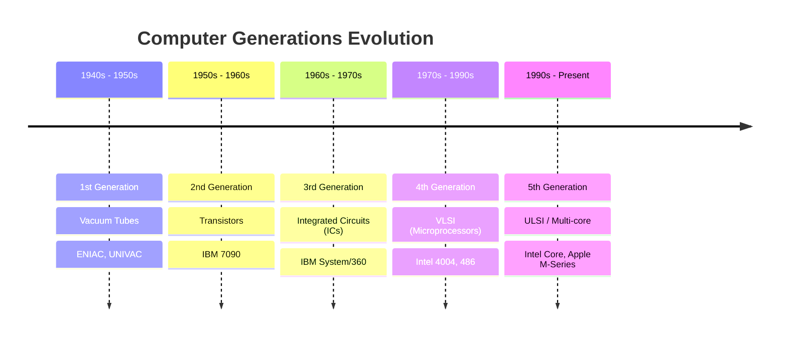
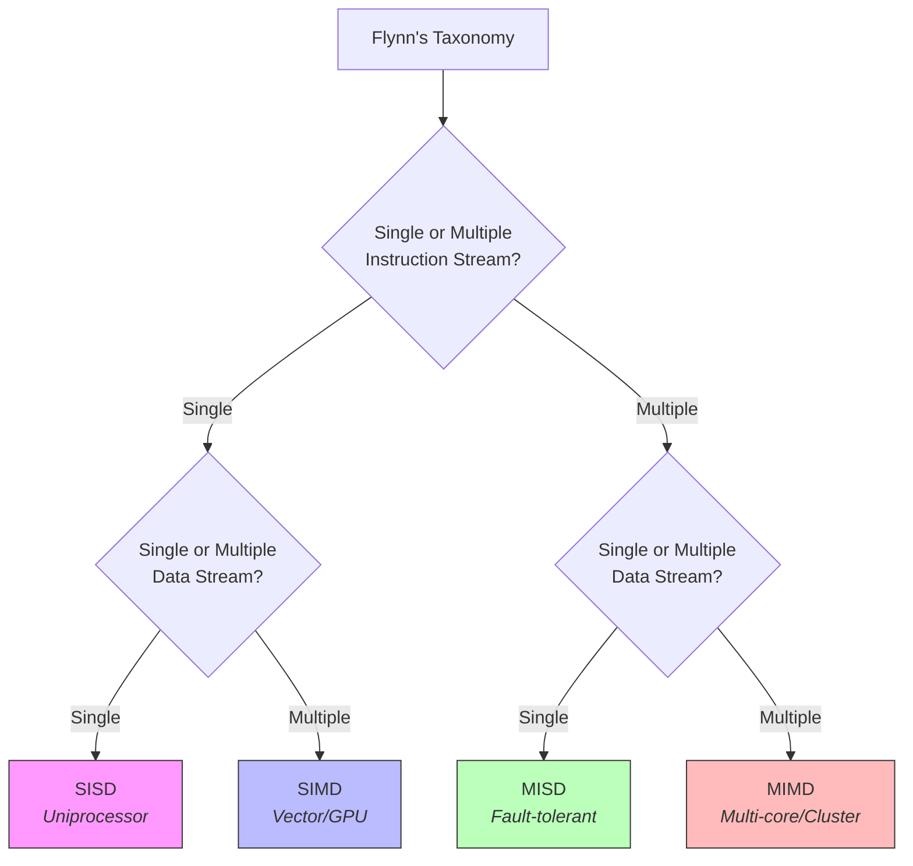
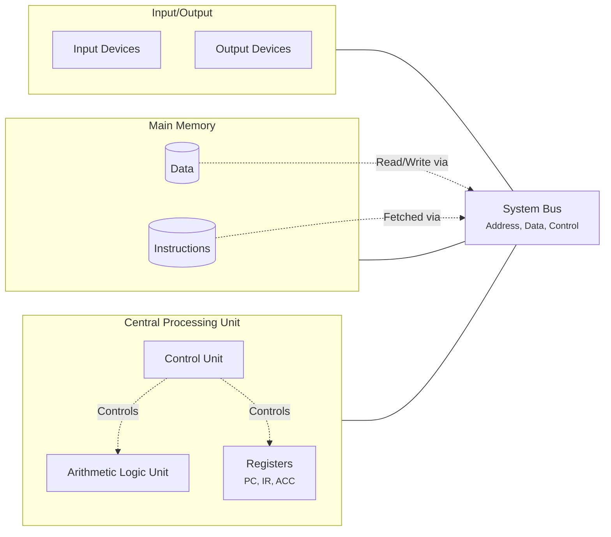
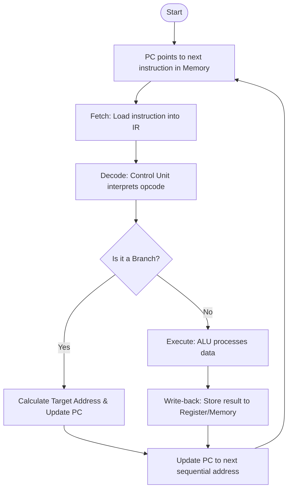
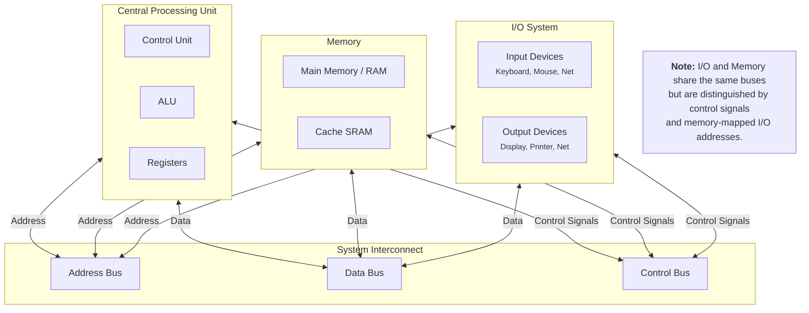

# Chapter 1: Introduction to Computer Systems

## 1.1 Historical Evolution of Computers: Generations (Vacuum Tubes to VLSI)

The evolution of computers is defined by the underlying switching technology. Each generation brought a massive leap in speed, cost, and reliability.

- **1st Gen (1940s–1950s): Vacuum Tubes** – Used for logic switching. Massive, generated extreme heat, and failed frequently. *Examples: ENIAC, UNIVAC I.*
- **2nd Gen (1950s–1960s): Transistors** – Replaced vacuum tubes. Smaller, faster, more reliable, and consumed less power. *Examples: IBM 7090.*
- **3rd Gen (1960s–1970s): Integrated Circuits (ICs)** – Multiple transistors placed on a single silicon chip (SSI/MSI). Birth of the microprocessor concept. *Examples: IBM System/360.*
- **4th Gen (1970s–1990s): VLSI (Very Large Scale Integration)** – Millions of transistors per chip. The personal computer revolution (Intel 4004, 8086). *Examples: Intel 486, Pentium.*
- **5th Gen (1990s–Present): ULSI / Multi-core / AI** – Billions of transistors. Shift from clock-speed scaling to parallel cores and domain-specific accelerators (GPUs, TPUs).

**Timeline Diagram:**

---

#### 1.2 Flynn’s Taxonomy: SISD, SIMD, MISD, MIMD Architectures

Proposed by Michael J. Flynn in 1966, this classification is based on the number of **instruction streams** and **data streams** a machine can handle simultaneously.

- **SISD (Single Instruction, Single Data):** A traditional uniprocessor (one core). One instruction operates on one data item at a time. *Examples: Classic Von Neumann machines, early Intel Pentium.*
- **SIMD (Single Instruction, Multiple Data):** One instruction operates on multiple data elements in parallel. Excellent for vector processing and graphics. *Examples: GPU shaders, AVX/SSE instructions in modern CPUs.*
- **MISD (Multiple Instruction, Single Data):** Multiple instructions operate on a single data stream. Rarely used in general computing; mostly found in fault-tolerant systems (redundant execution). *Example: Space shuttles (multiple computers checking the same sensor).*
- **MIMD (Multiple Instruction, Multiple Data):** Each processor executes its own instruction on its own data. Modern multi-core systems and distributed clusters. *Examples: Intel Core i9, AMD Ryzen, clusters.*

**Classification Diagram:**

---

#### 1.3 The Von Neumann Architecture: Stored-program concept & Fetch-Decode-Execute Cycle

John Von Neumann proposed the **"Stored Program"** concept in 1945. The core idea is that **both data and instructions** are stored in the same read/write memory. It consists of a **CPU** (with ALU and Control Unit), **Memory**, **I/O**, and **Bus**.

**Key Characteristic:** A single shared memory space and a sequential execution of instructions (which gives us the **Von Neumann Bottleneck**—the bus becomes a choke point).

**The Fetch-Decode-Execute Cycle:**
1.  **Fetch:** The Control Unit reads the next instruction from memory (pointed to by the Program Counter - PC) and places it into the Instruction Register (IR).
2.  **Decode:** The Control Unit decodes the instruction in the IR to determine the operation (e.g., ADD) and the operands (registers/memory addresses).
3.  **Execute:** The ALU performs the operation, or the control unit calculates the next address (for jumps).
4.  **Store (Write-back):** The result is written back into a register or memory.

**Architecture Diagram:**

**Flowchart for the Cycle:**

---

#### 1.4 Computer Architecture vs. Computer Organization

This is the fundamental distinction in COA. Think of it like **Architecture** is the "what" (the blueprint/contract), while **Organization** is the "how" (the physical implementation).

- **Architecture (The Interface):** Visible to the programmer/compiler writer. It defines the **Instruction Set Architecture (ISA)**, data types, registers, addressing modes, and memory size. It determines what the software can depend on.
  - *Example:* The x86-64 ISA. It specifies that you have 16 general-purpose registers and that a `MOV` instruction copies data. Software written for x86 must run on any x86 chip.
- **Organization (The Implementation):** The internal hardware details. It defines how the ISA is realized—pipelining, cache size, interconnect logic, clock speed, and core count.
  - *Example:* Both Intel Core i7 and AMD Ryzen implement the x86-64 ISA. However, their organization is vastly different (different caches, pipeline depths, branch predictors). They run the same software but perform differently.

| Aspect | Computer Architecture (ISA) | Computer Organization (Hardware) |
| :--- | :--- | :--- |
| **Focus** | Programmer's view | Hardware designer's view |
| **Components** | Opcodes, registers, addressing modes | ALU design, data paths, control signals |
| **Stability** | Backward-compatible (years/decades) | Changes frequently (every chip generation) |
| **Analogy** | The car's steering wheel & pedals | The engine's cylinder arrangement & fuel injectors |

---

#### 1.5 Functional Units of a Computer: CPU, Main Memory, I/O, System Interconnect

A computer system is built from four primary functional units that communicate via the **System Bus**.

1.  **Central Processing Unit (CPU):** The "brain" of the computer. It consists of:
    - **Control Unit (CU):** Directs the operation of the processor (fetching, decoding, and issuing control signals).
    - **ALU (Arithmetic Logic Unit):** Performs arithmetic (Add/Sub/Mul) and logical (AND/OR/XOR) operations.
    - **Registers:** Small, ultra-fast memory inside the CPU for temporary data (e.g., Program Counter, Stack Pointer, General Purpose Registers).

2.  **Main Memory (Primary Storage):** Typically RAM (Random Access Memory). Holds actively running programs and their data. It is volatile and byte-addressable. Technically, it is divided into **DRAM** (main) and **SRAM** (used in caches, though physically closer to CPU).

3.  **Input/Output (I/O) Devices:** Peripherals that allow the system to communicate with the outside world.
    - **Input:** Keyboard, mouse, sensors, network cards.
    - **Output:** Monitors, printers, actuators, network packets.

4.  **System Interconnect (The Bus System):** The communication pathway that connects the CPU, Memory, and I/O. It is composed of three distinct buses:
    - **Address Bus:** Carries the memory address (unidirectional, from CPU to Memory/I/O).
    - **Data Bus:** Carries the actual data (bidirectional).
    - **Control Bus:** Carries control signals (Read/Write, Interrupts, Clock).

**System Interconnection Diagram:**

---

### Summary Example

Imagine you are writing code in C: `int x = a + b;`
1.  **The Architecture (ISA)** defines that `a` and `b` are integers, and there is an `ADD` opcode.
2.  **The Organization** decides how fast this happens. A CPU with an out-of-order execution unit and a 4-wide superscalar pipeline (organization) will fetch and execute this single `ADD` much faster than a simple in-order microcontroller, even though they share the same ISA.
3.  The **Memory Unit** provides the data via the **Data Bus**, while the **Control Unit** sends a "Read" signal via the **Control Bus** to the address specified on the **Address Bus**.
4.  The **ALU** performs the addition, and the result is stored back in a register. All this happens in fractions of a nanosecond, governed by the clock derived from the transistor technologies discussed in generation 1.1!