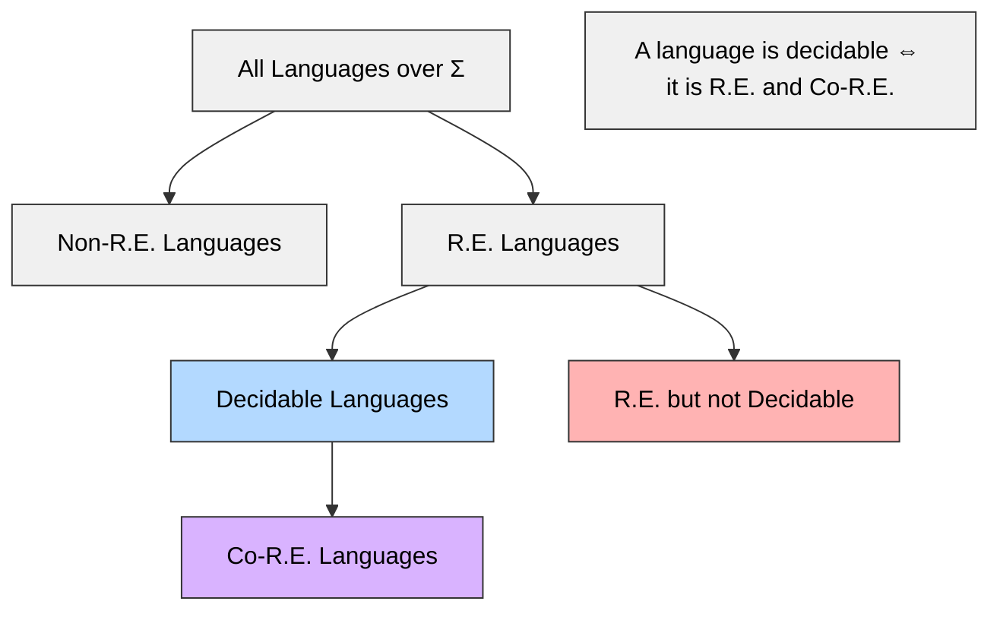
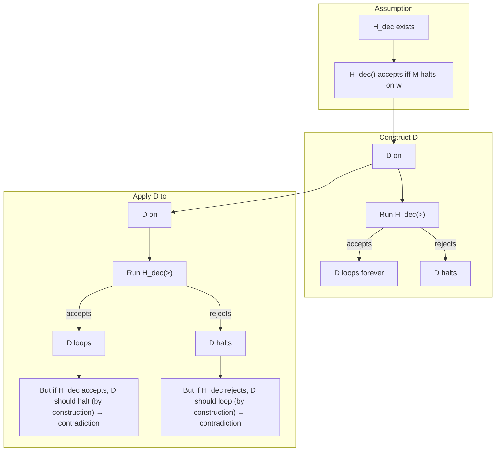
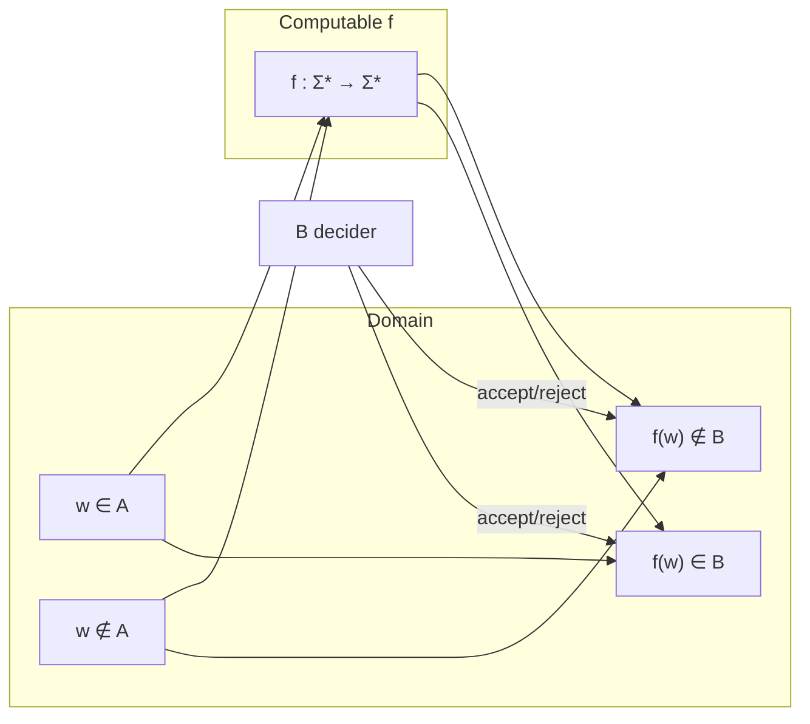
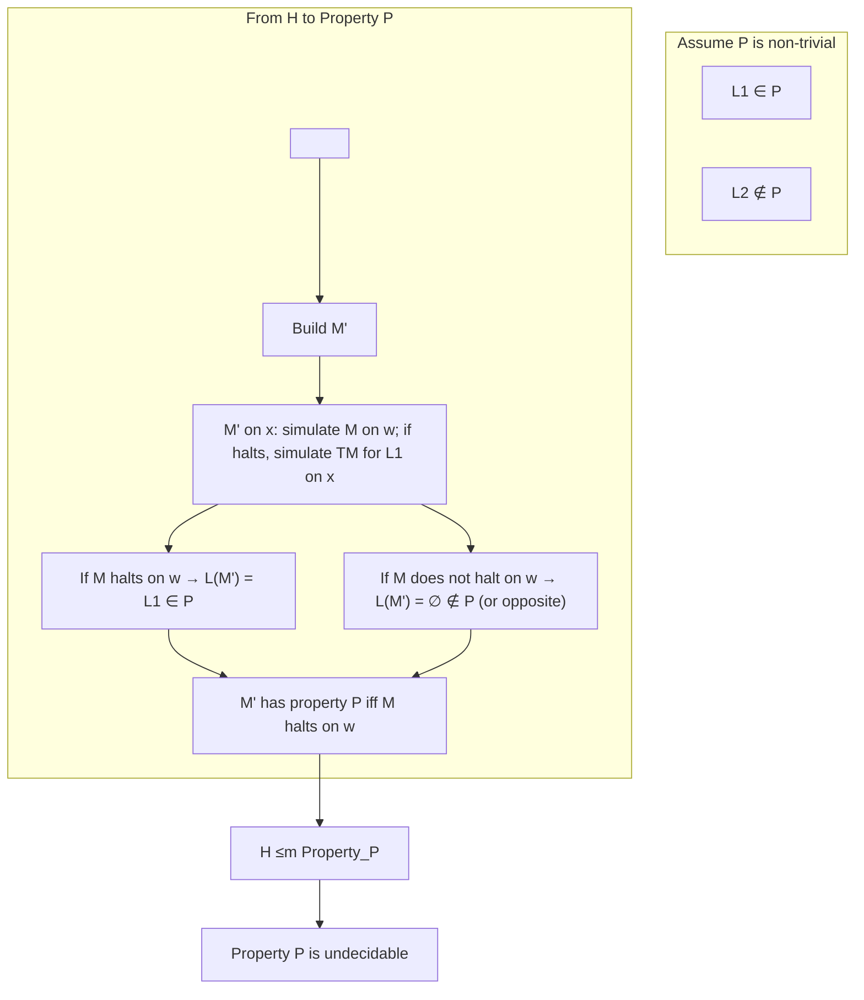
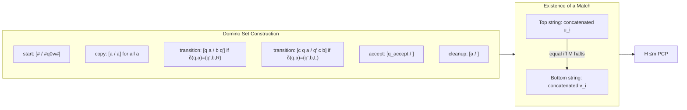

# Chapter 10: Decidability and Undecidability

## Introduction

Computability theory classifies problems according to whether they can be solved algorithmically. A problem is *decidable* if there exists a Turing machine (TM) that always halts with a correct yes/no answer. Problems that lack such a machine are *undecidable*. This chapter establishes the fundamental hierarchy of languages, proves the existence of undecidable problems via diagonalisation, and develops reduction techniques for transferring undecidability. We conclude with Rice’s Theorem and canonical undecidable problems: emptiness, regularity, and the Post Correspondence Problem.

---

## 1. Recursive (Decidable) vs. Recursively Enumerable Languages

### Definitions

- A language \(L \subseteq \Sigma^*\) is **recursive (decidable)** if there exists a Turing machine \(M\) such that:
  - For every \(w \in \Sigma^*\), \(M\) halts.
  - \(M\) accepts \(w\) iff \(w \in L\).
  - \(M\) rejects \(w\) iff \(w \notin L\).

- A language \(L\) is **recursively enumerable (r.e.)** if there exists a Turing machine \(M\) such that:
  - \(M\) accepts \(w\) iff \(w \in L\).
  - For \(w \notin L\), \(M\) may either reject or loop forever (i.e., it need not halt).

### Relationship

- Every decidable language is r.e., but the converse is false.
- A language is decidable iff both it and its complement are r.e.
- There exist r.e. languages whose complement is not r.e.; these are strictly undecidable.

**Mermaid Venn Diagram:**

---

## 2. Decidable and Undecidable Languages – Formal Characterisation

A decision problem \(P\) is identified with the language \(L_P = \{ w \mid w \text{ is a positive instance of } P \}\).

- **Decidable**: There exists a TM \(M\) that, for every input, halts in an accepting or rejecting state. Membership is computationally tractable in principle.
- **Undecidable**: No such TM exists. For any candidate TM, there is at least one input on which it either gives the wrong answer or fails to halt.

**Example of a Decidable Problem:**  
*Does a given DFA accept the empty language?* This is decidable by checking reachability of accepting states.

**Example of an Undecidable Problem:**  
*Does a given TM halt on a given input?* – the Halting Problem.

---

## 3. The Halting Problem – Statement and Diagonalisation Proof

### Problem Statement

Define the Halting Language:

\[
H = \{ \langle M, w \rangle \mid M \text{ is a Turing machine and } M \text{ halts on input } w \}.
\]

**Theorem:** \(H\) is undecidable.

### Proof by Diagonalisation

Assume, for contradiction, that \(H\) is decidable. Then there exists a TM \(H_{\text{dec}}\) that, on input \(\langle M, w \rangle\), halts and accepts if \(M\) halts on \(w\), rejects otherwise.

Construct a new TM \(D\) as follows:
1. On input \(\langle M \rangle\) (a description of a TM), run \(H_{\text{dec}}\) on \(\langle M, \langle M \rangle \rangle\).
2. If \(H_{\text{dec}}\) accepts (i.e., \(M\) halts on its own description), then \(D\) loops forever.
3. If \(H_{\text{dec}}\) rejects (i.e., \(M\) does not halt on its own description), then \(D\) halts.

Now consider the behaviour of \(D\) on its own description \(\langle D \rangle\):
- If \(D\) halts on \(\langle D \rangle\), then by construction (step 2) it must loop – contradiction.
- If \(D\) loops on \(\langle D \rangle\), then by construction (step 3) it must halt – contradiction.

Hence \(H_{\text{dec}}\) cannot exist, so \(H\) is undecidable.

**Mermaid Flowchart for Diagonalisation:**

---

## 4. Reductions and Reduction Techniques

### Many-One (Mapping) Reductions

A language \(A\) is **many-one reducible** to language \(B\) (notation \(A \le_m B\)) if there exists a computable total function \(f: \Sigma^* \to \Sigma^*\) such that:

\[
\forall w, \quad w \in A \iff f(w) \in B.
\]

**Properties:**
- If \(A \le_m B\) and \(B\) is decidable, then \(A\) is decidable.
- If \(A \le_m B\) and \(A\) is undecidable, then \(B\) is undecidable.
- The reduction preserves membership status; it is a "yes-instance maps to yes-instance, no-instance maps to no-instance" transformation.

**Mermaid Diagram of Reduction:**

**Example Reduction:**  
The problem *Does a TM accept the empty string?* can be reduced from the Halting Problem. Given \(\langle M, w \rangle\), construct a new TM \(M_w\) that ignores its input, writes \(w\) on the tape, and simulates \(M\) on \(w\). Then \(M_w\) halts on empty input iff \(M\) halts on \(w\). Thus \(H \le_m \text{EMPTY}_\text{TM}\), proving the latter undecidable.

---

## 5. Rice’s Theorem

### Statement

Let \(\mathcal{P}\) be a set of recursively enumerable languages (i.e., a property of r.e. languages). Suppose:
1. \(\mathcal{P}\) is non-trivial: there exists at least one r.e. language \(L_1\) that satisfies \(\mathcal{P}\), and at least one r.e. language \(L_2\) that does not satisfy \(\mathcal{P}\).
2. \(\mathcal{P}\) is a property of the language itself, not of the particular TM description (i.e., if \(L(M_1) = L(M_2)\), then \(\mathcal{P}\) holds for \(M_1\) iff it holds for \(M_2\)).

Then the problem of deciding, for an arbitrary TM \(M\), whether \(L(M) \in \mathcal{P}\), is undecidable.

### Proof Sketch

Assume \(\mathcal{P}\) is non-trivial. Let \(L_\emptyset\) be the empty language (which may or may not satisfy \(\mathcal{P}\)). We reduce from the Halting Problem.

- If \(\emptyset \notin \mathcal{P}\), pick an r.e. language \(L_\mathcal{P} \in \mathcal{P}\). Given \(\langle M, w \rangle\), construct a TM \(M'\) that, on input \(x\):
  1. Simulates \(M\) on \(w\).
  2. If \(M\) halts, simulate a TM for \(L_\mathcal{P}\) on \(x\) and accept iff that accepts.
  Then \(M'\) accepts exactly \(L_\mathcal{P}\) if \(M\) halts on \(w\), otherwise it accepts \(\emptyset\). Therefore \(M' \in \mathcal{P}\) iff \(M\) halts on \(w\), so \(H \le_m \text{Property}_{\mathcal{P}}\).

- If \(\emptyset \in \mathcal{P}\), take its complement property (which is also non-trivial) and apply the same logic.

Thus any non-trivial, extensional property is undecidable.

### Consequences

Rice’s Theorem immediately implies the undecidability of:
- Emptiness: \(L(M) = \emptyset\)?
- Finiteness: \(L(M)\) finite?
- Regularity: \(L(M)\) regular?
- Context-freeness, etc.

All are undecidable for arbitrary TMs.

**Mermaid Diagram for Rice's Theorem Reduction:**

---

## 6. Proofs of Undecidability for Emptiness, Regularity, and PCP

### 6.1 Emptiness Problem

**Problem:** Given a TM \(M\), is \(L(M) = \emptyset\)? (Language: \(E_{\mathrm{TM}} = \{\langle M \rangle \mid L(M) = \emptyset\}\))

**Proof of Undecidability:** Reduce from the Halting Problem. For any \(\langle M, w \rangle\), construct a TM \(M_w\):
- On input \(x\), \(M_w\) ignores \(x\) and simulates \(M\) on \(w\).
- If \(M\) halts on \(w\), \(M_w\) accepts \(x\) (so \(L(M_w) = \Sigma^*\)).
- If \(M\) does not halt on \(w\), \(M_w\) accepts nothing (so \(L(M_w) = \emptyset\)).

Then:
\[
\langle M, w \rangle \in H \iff L(M_w) \neq \emptyset \iff \langle M_w \rangle \notin E_{\mathrm{TM}}.
\]
Thus \(H \le_m \overline{E_{\mathrm{TM}}}\). Since \(\overline{E_{\mathrm{TM}}}\) is undecidable (as complement of a decidable language would be decidable), \(E_{\mathrm{TM}}\) is undecidable.

### 6.2 Regularity Problem

**Problem:** Given a TM \(M\), is \(L(M)\) regular? (Language: \(R_{\mathrm{TM}} = \{\langle M \rangle \mid L(M) \text{ is regular}\}\))

**Proof of Undecidability:** Reduce from the Halting Problem. For \(\langle M, w \rangle\), construct a TM \(M'\) that, on input \(x\):
- If \(x\) is of the form \(0^n 1^n\) (a non-regular pattern), accept \(x\) immediately.
- Otherwise, simulate \(M\) on \(w\). If \(M\) halts, accept \(x\); else loop.

Now analyse \(L(M')\):
- If \(M\) halts on \(w\): \(L(M') = \Sigma^*\) (all strings accepted) – regular.
- If \(M\) does not halt on \(w\): \(L(M') = \{0^n 1^n \mid n \ge 0\}\) – non-regular.

Therefore:
\[
\langle M, w \rangle \in H \iff \langle M' \rangle \in R_{\mathrm{TM}}.
\]
Hence \(H \le_m R_{\mathrm{TM}}\), so \(R_{\mathrm{TM}}\) is undecidable.

### 6.3 Post Correspondence Problem (PCP)

**Problem Statement:**  
An instance of PCP consists of a finite set of dominoes (tiles) of the form \(\begin{bmatrix} u_i \\ v_i \end{bmatrix}\) where \(u_i, v_i\) are strings over some alphabet \(\Sigma\). The question is: does there exist a finite sequence of indices \(i_1, i_2, \dots, i_k\) (with repetitions allowed) such that
\[
u_{i_1} u_{i_2} \cdots u_{i_k} = v_{i_1} v_{i_2} \cdots v_{i_k}?
\]
The top string equals the bottom string.

**Theorem:** PCP is undecidable.

**Proof Outline:** The proof reduces from the Halting Problem via a simulation of a Turing machine's computation history. The idea is:

1. Given a TM \(M\) and input \(w\), construct a set of dominoes that encode the initial configuration, the transition rules, and the final accepting configuration of \(M\) on \(w\).
2. The dominoes are designed so that a match exists iff \(M\) halts on \(w\). The match essentially produces a sequence of configurations separated by markers, simulating the computation step by step.
3. The construction forces the top and bottom strings to be identical only when the simulated computation reaches an accepting state.

This reduction is intricate but standard. The critical point is that the existence of a match is equivalent to the existence of a finite halting computation.

**Mermaid Illustration of PCP Reduction Concept:**

**Key Insight:** The match forces a sequence of configurations where each configuration's boundary is synchronised. The undecidability of PCP is a powerful tool because it is a "pure string rewriting" problem with no explicit machine model, yet it captures all computational power.

---

## Summary Table

| Problem | Language | Decidability | Technique |
|---------|----------|--------------|-----------|
| Halting Problem | \(H = \{\langle M,w \rangle \mid M \text{ halts on } w\}\) | Undecidable | Diagonalisation |
| Emptiness | \(E_{\mathrm{TM}} = \{\langle M \rangle \mid L(M)=\emptyset\}\) | Undecidable | Reduction from H |
| Regularity | \(R_{\mathrm{TM}} = \{\langle M \rangle \mid L(M) \text{ is regular}\}\) | Undecidable | Reduction from H |
| Post Correspondence | PCP = \(\{\text{set of dominoes} \mid \exists \text{ match}\}\) | Undecidable | Reduction from H (computation history) |

Rice's Theorem subsumes the first two and many others, but PCP stands apart because it does not directly involve TMs, yet it is a quintessential undecidable problem in formal language theory.

---

## Conclusion

Decidability and undecidability form the bedrock of theoretical computer science. The diagonalisation proof for the Halting Problem established the existence of unsolvable problems. Reductions provide a systematic method to propagate undecidability. Rice's Theorem offers a sweeping generalisation: any non-trivial semantic property of r.e. languages is undecidable. Finally, problems like emptiness, regularity, and PCP illustrate the breadth of undecidable phenomena, from machine properties to pure combinatorics on strings. These results compel us to recognise the inherent limits of algorithmic computation, shaping our understanding of what is computable in principle.